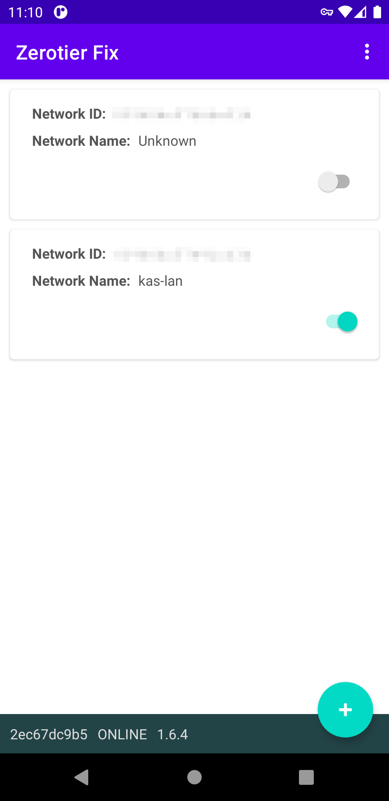
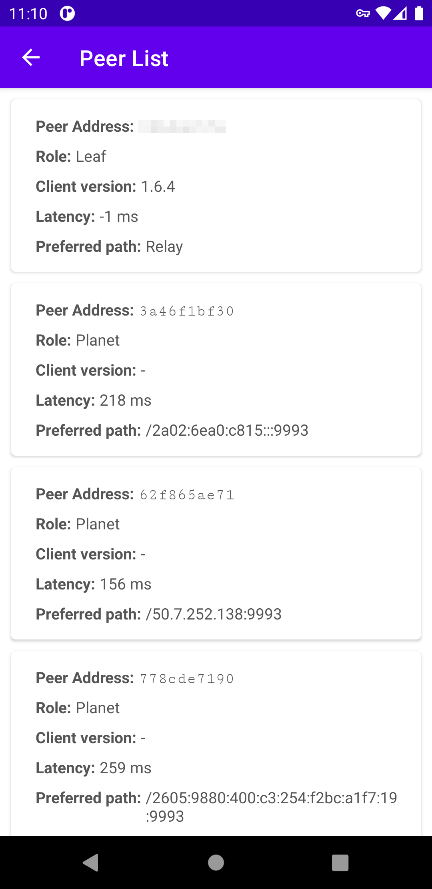
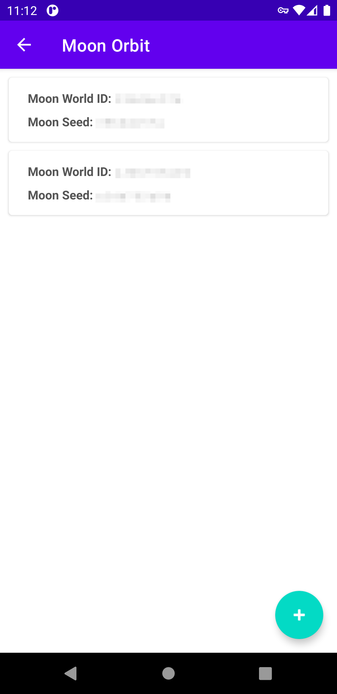

<h1 align="center">
  
   Zerotier Fix 
</h1>

<h4 align="center">An unofficial Zerotier Android client patched from official client.</h4>

  
  
  

    

## Features

- Self-hosted Moon Support
- Add custom planet config via file and URL
- View peers list
- Chinese translation

## Download

Check [Releases page](https://github.com/kaaass/ZerotierFix/releases) for latest version.

If you want to try the nightly build, you can download it from [GitHub Actions](https://github.com/kaaass/ZerotierFix/actions/workflows/build-app.yml?query=branch%3Amaster).
But please note that the nightly build may be **BUGGY** and **UNSTABLE**.

## Copyright

The code for this repository is based on the reverse engineering of the official Android client. The
original author is Grant Limberg (glimberg@gmail.com). See [AUTHORS.md](https://github.com/zerotier/ZeroTierOne/blob/master/AUTHORS.md#primary-authors) for more details.

- Zerotier JNI Sdk is located in git submodule `externals/core`
- Original Android client code is located in `net.kaaass.zerotierfix` (renamed from `com.zerotier.one`)
- App logo is a trademark of `ZeroTier, Inc.` and made by myself. 

## Roadmap

- [X] Add moon config persistent & file config
- [x] Add peer list view
- [x] Support planet config
- [x] Replace pre-built JNI library
- [x] Rewrite & update UI to fit Material Design
- [ ] *WIP* Rewrite whole APP in v2
